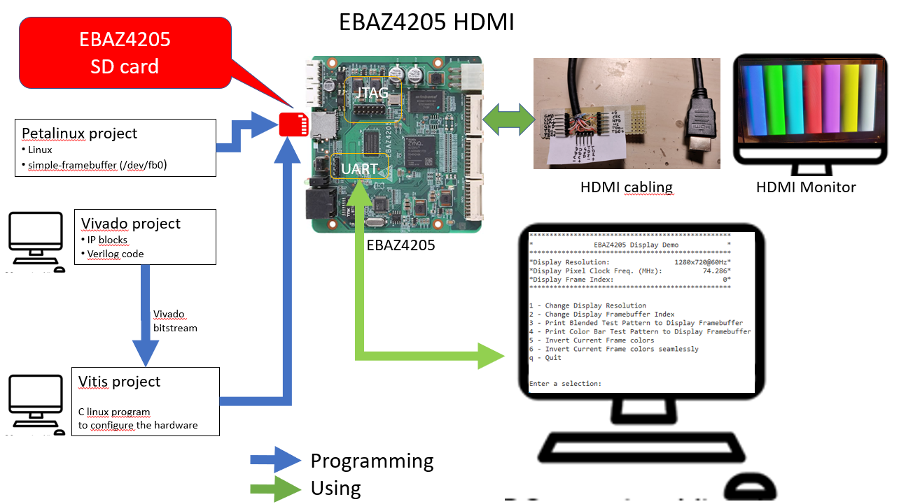

# EBAZ4205_HDMI

## Description

This repository contains the Vivado project, the PetaLinux project, and the Vitis software projects (both Standalone and Linux) to implement the EBAZ4205 board with an HDMI video out port.

The result will be an EBAZ4205:
* loading from the SD Card
* with a hardware HDMI out port directly connected to the J1 EBAZ4205 connector (no extra hardware required)
* running Linux (PetaLinux):
    * connected to a local network via Ethernet (IP obtained by DHCP)
    * with a serial console connected to the J7 connector of EBAZ4205 (serial)
    * with a SSH server connectable with any SSH client and/or WinSCP  
    * any application running on a linux console
    * with a HDMI video out port (640x480 or 800x600 or 1080x720) 

## Hardware Requirements

* EBAZ4205 (with or without 25MHz crystal)
* HDMI cable

See:
* [Cheap (35$) and powerful FPGA programming](https://hackaday.io/project/187351-cheap-35-and-powerful-fpga-programming)
 for preparing the EBAZ4205 (power supply, JTAG and serial connections, Ethernet)
 
### Software tools

* Vivado 2021.2 on Windows 10 or 11
* VMWare VirtualBox 6.1 on Windows 10 or 11
* Ubuntu 20.04.1 on VMWare VirtualBox 6.1
* Petalinux 2021.2 on Ubuntu 20.04.1

## How to Build
1) Build the HDMI hardware port (see my Hackaday project=)
2) Download my EBAZ4205_HDMI.wic file, flash it on an SD card (with Balena-Etcher or similar program) and go! (TODO)
or 
2) Download the Vivado Project, create the bitstream and export the hardware
3) Download the Vitis Project, "update the hardware" with the just exported hardware ild  Read carefully my Hackaday Project: [Cheap (35$) and powerful FPGA programming](https://hackaday.io/project/187351-cheap-35-and-powerful-fpga-programming)
* Create the block design, the bitstream and the hardware definition with Vivado
* [Use the hardware definition to build an bootable SD Card with petalinux and test it on EBAZ4205](./docs/how-to-build.md)

## References

### My Hackaday projects with EBAZ4205
* [Cheap (35$) and powerful FPGA programming](https://hackaday.io/project/187351-cheap-35-and-powerful-fpga-programming)

### EBAZ4205

* [KeitetsuWorks EBAZ4205](https://github.com/KeitetsuWorks/EBAZ4205)

## License

* MIT
